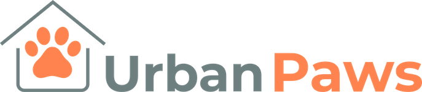

<!-- Remember to add link to website from logo -->

# Urban Paws Website

Working with the company director, this website has been developed as the first iteration for a new startup company Urban Paws. The website provides potential customers with an overview of the company and information in relation to products that are have been developed and products that are for sale via links to listings on Amazon.co.uk.

The client requested a simple, attractive and modern website that is responsive and easy to navigate, that allows potential customers to sign up for email updates on company news, that provides links to the company social media accounts and links to enable the customer to purchase products.

The site was developed using knowledge gained from the Code Institute HTML, CSS and User Centric Frontend Development modules.

View the live website [here.](https://matty-el.github.io/urban-paws/)

<!-- Include well presented mock-up images of website on different devices -->

## Contents

1.  [User Experience Design](#user-experience-design)
2.  [Features](#features)
3.  [Planning, Tracking and Collaboration](#planning-tracking-collaboration)
4.  [Technologies Used](#technologies-used)
5.  [Testing](#testing)
6.  [Deployment](#deployment)
7.  [Credits](#credits)

## User Experience Design

### Strategy

The business goals for developing the website are:

-   To attract users to the company website to promote the company and brand awareness and to drive online enquiries.
-   To enable users to link through to Amazon listings so that they can purchase products.
-   To provide a simple, attractive, modern and responsive website.
-   To present a consistent brand image to users.

### Scope

#### User Stories

#### Business

-   As the branding director, I want the company branding template to be applied to the website so that the company presents a consistent brand image.
-   As the business owner, I want the company website latency to be optimised so that users are less likely to abandon our website whilst using it.
-   As the business owner, I want the company website to be search engine optimised so that users can easily find our website.
-   As the business owner, I want the company website to be accessible to all users so that all users can use our website.
-   As the business owner, I want the company website to be conformant to web development best practices so that I know the development quality meets required standards.
-   As the business owner, I want the company website to be compatible with different browsers so that users have a consistent experience no matter which browser they use.

#### First time visitors

-   As a first-time visitor to the website, I want to be able to access the website on different devices so that i can use the device that is most convenient to me at the time.
-   As a first-time visitor, I want to be able to easily navigate the website so that I can find out more about the company and it's offerings.
-   As a first-time visitor, I want to be able to follow the company on social media platforms so that I can stay informed about the company.

#### Returning visitors

-   As a returning visitor, I want to be able to contact the company so that I can ask questions or receive announcements and updates about the company.
-   As a returning visitor, I want to be able see products for purchase so that i can buy items i need.

### Structure

The Urban Paws website has been structured to provide a simple and easy to navigate website. There are four pages - Home, Shop Dog, Shop Cat and About Us and a Contact form so that users can contact the company to provide comments, make enquiries and / or sign up to the Urban Paws newsletter.

The website has the following key elements:

-   A simple navigation menu which enables the users to easily navigate between the website pages.
-   Links to social media sites so that users can follow the company on social media.
-   Call to action buttons are present on the Home page to encourage the users to click through to the contact form and shop pages.
-   The shop pages contain the product listings along with size-guides and a link to enable the customers to purchase the   products via Amazon.co.uk
-   The contact menu item provides a form which the users can populate to provide comments, make enquiries and / or sign up to the Urban Paws newsletter.

### Skeleton

#### Wireframes

-   Small device [wireframes](assets/design/Urban_Paws_Wireframes_Small_v1.0.pdf)
-   Medium device [wireframes](assets/design/Urban_Paws_Wireframes_Medium_v1.0.pdf)
-   Large device [wireframes](assets/design/Urban_Paws_Wireframes_Large_v1.0.pdf)

### Surface

Working with the client an [Urban Paws Branding Template](assets/design/Urban_Paws_Branding_Template.pdf) has been developed to ensure a strong and consistent brand image has been applied to the Urban Paws website.

#### Branding

An Urban Paws logo has been developed and is displayed prominantly on the website pages.

#### Colours

A simple colour palette has been developed based on the three core Urban Paws colours. Full details of the colour scheme is contained in the [Urban Paws Branding Template](assets/design/Urban_Paws_Branding_Template.pdf).

#### Typography

The Montserrat font has been utilised for all menu and heading text across the website. Raleway font has been used for the main text sections. Full details of the typography used is contained in the [Urban Paws Branding Template](assets/design/Urban_Paws_Branding_Template.pdf).

## Features

### Existing Features

TO BE COMPLETED

-   Feature 1 - allows users X to achieve Y, by having them fill out Z
-   ...

For some/all of your features, you may choose to reference the specific project files that implement them, although this is entirely optional.

In addition, you may also use this section to discuss plans for additional features to be implemented in the future:

### Features Left to Implement

-   Blog
-   Featured products
-   Shopping cart
-   eCommerce capabilities

## Technologies Used

TO BE COMPLETED

The following technologies have been used to complete the UX design, capture user stories and defects and assign for development and to develop the Urban Paws website.

### Languages

-   HTML5
-   CSS3

### Frameworks - Tools - Libraries

-   Bootstrap 4.5.2
-   jQuery
-   Git
-   GitHub
-   GitPod
-   Google Fonts
-   Font Awesome
-   Balsamiq
-   Tiny PNG
-   JIRA
-   Frontify
-   HTML Validator
-   CSS validator

## Testing

The website functionality was captured in the form of user stories and acceptance criteria were defined for each user story. The acceptance criteria formed the basis for the completed tests to ensure that the functionality was delivered aligned to the client's requirements.

The testing strategy, plan and results are documented in a separate [testing document](TESTING.md).

## Deployment

**To deploy the project on GitHub**

The Urban Paws project is hosted on GitHub Pages.

1. Navigate to the menu at the top of the project repository on GitHub and select **Settings**.
2. Scroll down to the GitHub **Pages** section.
3. Click on the dropdown menu under **Source** and select **Master Branch**.
4. The page will refresh automatically and the website is now deployed - a green tick will be visible against a green background with the site URL. It may take a few minutes for the site to be published.

A single master branch has been used for this project.

**To run the project locally**

To clone this project from GitHub.

1. Open the project repository on GitHub and click the Code dropdown button.
2. Select **HTTPS** and copy the URL.
3. In your preferred IDE, open **Git Bash**.
4. Change the current working directory to the location where you want the cloned directory to be created.
5. Type **git clone**, and then paste the URL copied from GitHub.
6. Press **Enter** and the local clone will be created.

## Credits

### Content

-   The text for section Y was copied from the [Wikipedia article Z](https://en.wikipedia.org/wiki/Z)

### Media

-   The photos used in this site were obtained from ...

### Acknowledgements

Jane Davenport for giving me the opportunity to develop a website for her new business

[Precious Ijege](https://www.linkedin.com/in/precious-ijege-908a00168/?originalSubdomain=ng) for mentor guidance and support.
