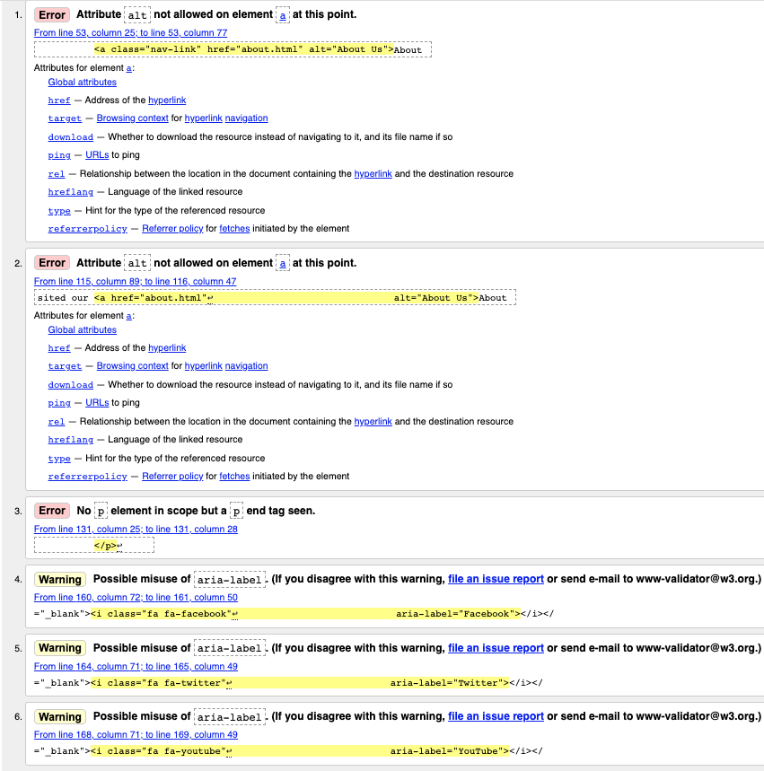
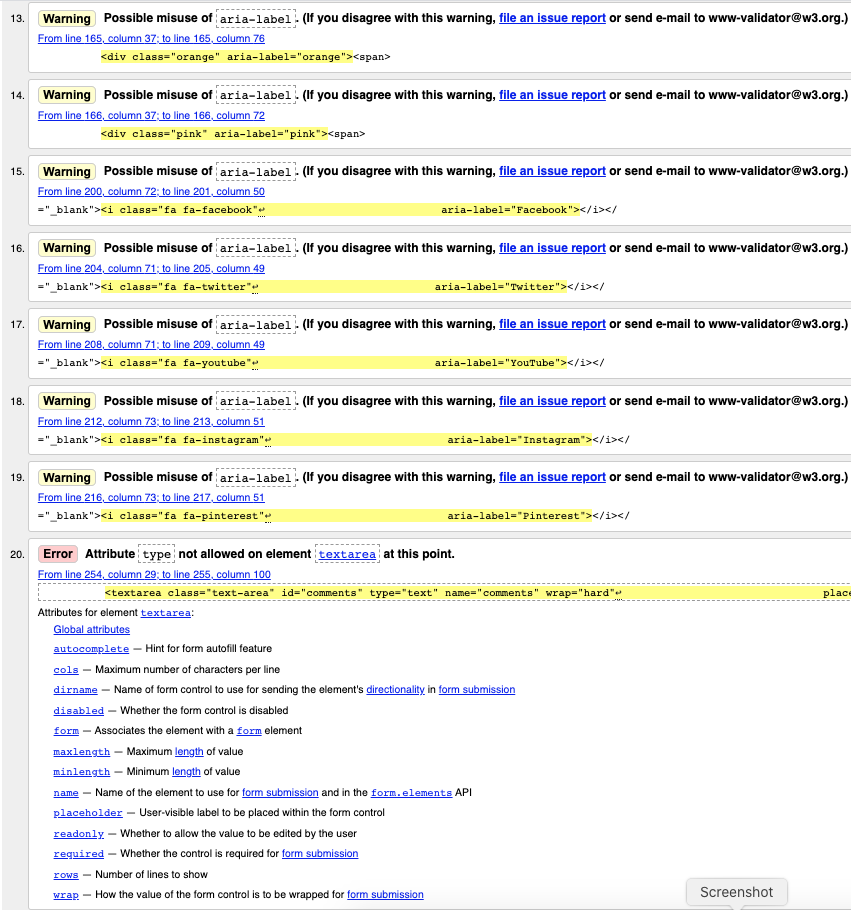
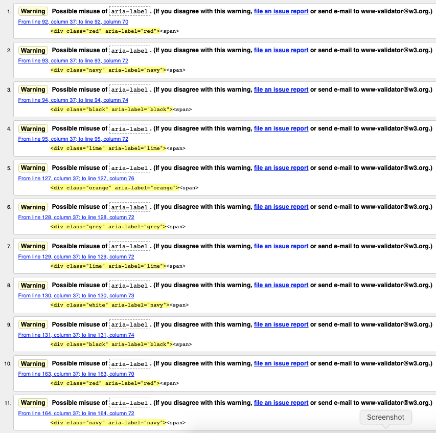
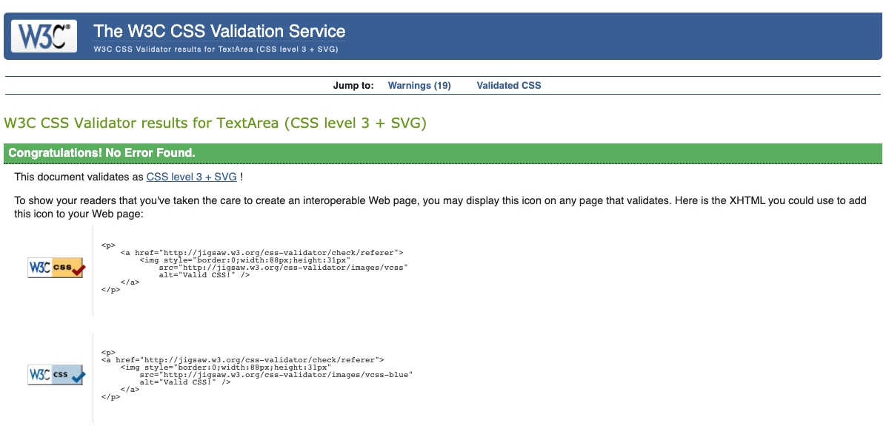

# Test Strategy

## Contents

1.  [Scope and Overview](#scope-and-overview)
2.  [Test Approach](#test-approach)
3.  [Test Tools](#test-tools)
4.  [Review and Approvals](#review-and-approvals)
5.  [Test Results](#test-results)
6.  [Approvals](#approvals)

### Scope and Overview

The Urban Paws website is a basic static website that has been developed for a startup company. The website enables users to find out more about the company, view products for sale and link to the Amazon listing for purchase of the products, link to the company social media accounts and contact the company via a contact form. The website is comprised of four pages - Home, Shop-Dog, Shop-Cat and About Us, with modals incorporated for the contact form and product size guides.

The website has been developed using HTML5 and CSS3 and utilises the Bootstrap4 toolkit.

This document has been prepared to outline the testing strategy and will be approved by the owner of the Urban Paws business and website.

The testing consists of two cycles, each with two phases. Within each test cycle the developer completes the first phase of testing prior to the business owner conducting their own testing.

View the live website [here.](https://matty-el.github.io/urban-paws/)

### Test Approach

The user requirements have been captured in the form of user stories and acceptance criteria have been defined against which to test the website functionality.

Defects identified during test cycle 1 of the testing process are captured in JIRA, fixed and then released to be re-tested in test cycle 2.

The testing to be completed along with the roles completing the testing are outlined below:

- Code validation - Roles: developer
- Functional testing - Roles: developer and business owner
- Usability testing - Roles: developer and business owner
- Compatibility testing (browser compatibility, mobile compatibility and responsiveness) - Roles: developer
- Performance testing - Roles: developer
- Accessibility testing - Roles: developer
- Best Practices testing - Roles: developer
- SEO testing - Roles: developer

### Test Tools

- Code validation: [W3.org markup validation service](https://validator.w3.org/), [W3.org CSS validation service](https://jigsaw.w3.org/css-validator/).
- Compatibility testing (browser compatibility and mobile compatibility) - [Google Chrome DevTools - Lighthouse](https://developers.google.com/web/tools/lighthouse), [Responsiveness Checker](https:).
- Performance testing: [Google Chrome DevTools - Lighthouse](https://developers.google.com/web/tools/lighthouse).
- SEO testing: [Google Chrome DevTools - Lighthouse](https://developers.google.com/web/tools/lighthouse)
- Defect capture and tracking: [JIRA](https://www.atlassian.com/software/jira).

### Review and Approvals

Following the final cycle of testing the website will be approved for release by the Urban Paws business owner.

### Test Results

### Test Cycle 1

#### Code validation

**HTML**

The HTML code was validated using the [W3.org markup validation service](https://validator.w3.org/).

[W3.org markup validation service](https://validator.w3.org/)

Home page:

Issues identified and resolution:

-   Error Attribute alt not allowed on element a at this point - removed alt attributes from anchor elements.
-   Error no p element in scope but a p end tag seen - removed erroneous paragraph closing tag.
-   Warning Possible misuse of aria-label - removed aria labels from icons and added to anchor elements.
-   Error Attribute type not allowed on element textarea at this point - removed type attribute from textarea element.
-   Error Element textarea is missing required attribute - added missing cols attribute to textarea element.

Shop Dog page:

Issues identified and resolution:

-   Warning Possible misuse of aria-label - removed aria labels from colour swatches.
-   Warning Possible misuse of aria-label - removed aria labels from icons and added to anchor elements.
-   Error Attribute type not allowed on element textarea at this point - removed type attribute from textarea element.
-   Error Element textarea is missing required attribute - added missing cols attribute to textarea element.

Shop Cat page:

Issues identified and resolution:

-   Warning Possible misuse of aria-label - removed aria labels from colour swatches.
-   Warning Possible misuse of aria-label - removed aria labels from icons and added to anchor elements.
-   Error Attribute type not allowed on element textarea at this point - removed type attribute from textarea element.
-   Error Element textarea is missing required attribute - added missing cols attribute to textarea element.

About Us page:

Issues identified and resolution:

-   Warning Possible misuse of aria-label - removed aria labels from icons and added to anchor elements.
-   Error Attribute type not allowed on element textarea at this point - removed type attribute from textarea element.
-   Error Element textarea is missing required attribute - added missing cols attribute to textarea element.

**CSS**

The CSS code was validated using the [W3.org CSS validation service](https://jigsaw.w3.org/css-validator/).

#### Functional, Usability, Compatibility and Responsiveness Testing

The functional, usability and compatibility test results and defect references are detailed in the [test tracker](testing-files/urban-paws-website-test-tracker-cycle-1.pdf).

The website was tested for responsiveness using [Google Chrome DevTools - Lighthouse](https://developers.google.com/web/tools/chrome-devtools) and [Responsive Design Checker](https://www.responsivedesignchecker.com/)

Results:

INCLUDE A TABLE

#### Performance, Accessibility, Best Practices and SEO Testing

**Desktop:**

[Home page](https://matty-el.github.io/urban-paws/testing-files/desktop-index-test-cycle-1.html)

Issues identified and resolution:

Due to the technical nature of some opportunities being beyond the scope of this project the following have been addressed:

Performance (98)

-   Opportunity: Properly size images - images resized.
-   Opportunity: Eliminate render-blocking resources - deferred the loading of Bootstrap scripts.

Accessibility (98)

-   Contrast: Background and foreground colours do not have sufficient contrast ratio - Shop, About Us and Contact menu items - changed text colour to #566465 to achieve greater contrast and the current page link changed to 500 weight font.

Best Practices (79)

-   Trust and Safety: Links to cross-origin destinations are unsafe - added rel="noopener and norefferer" tags to Links.
-   Trust and Safety: Includes front-end JavaScript libraries with known security vulnerabilities - updated to libraries with no vulnerabilities.
-   User Experience: Displays images with incorrect aspect ratio (Shop Cat image) - changed aspect ratio.

SEO (90)

-   Content Best Practices: Document does not have a meta-description - a meta-description is included and is now recognised.
 

[Shop Dog page](https://matty-el.github.io/urban-paws/testing-files/desktop-shop-dog-test-cycle-1.html)

Due to the technical nature of some opportunities being beyond the scope of this project the following have been addressed:

Performance (98)

-   Opportunity: Properly size images - images resized.
-   Opportunity: Eliminate render-blocking resources - deferred the loading of Bootstrap scripts.

Accessibility (98)

-   Contrast: Background and foreground colours do not have sufficient contrast ratio - Shop, About Us and Contact menu items - changed text colour to #566465 to achieve greater contrast and the current page link changed to 500 weight font.

Best Practices (79)

-   Trust and Safety: Links to cross-origin destinations are unsafe - added rel="noopener and norefferer" tags to Links.
-   Trust and Safety: Includes front-end JavaScript libraries with known security vulnerabilities - updated to libraries with no vulnerabilities.
-   User Experience: Displays images with incorrect aspect ratio (Shop Cat image) - changed aspect ratio.

SEO (80)

-   Content Best Practices: Document does not have a meta-description - a meta-description is included and now recognised.

 

[Shop Cat page](https://matty-el.github.io/urban-paws/testing-files/desktop-shop-cat-test-cycle-1.html)

Due to the technical nature of some opportunities being beyond the scope of this project the following have been addressed:

Performance (97)

-   Opportunity: Properly size images - images resized.
-   Opportunity: Eliminate render-blocking resources - deferred the loading of Bootstrap scripts.

Accessibility (98)

-   Contrast: Background and foreground colours do not have sufficient contrast ratio - Shop, About Us and Contact menu items - changed text colour to #566465 to achieve greater contrast and the current page link changed to 500 weight font.

Best Practices (79)

-   Trust and Safety: Links to cross-origin destinations are unsafe - added rel="noopener and norefferer" tags to Links.
-   Trust and Safety: Includes front-end JavaScript libraries with known security vulnerabilities - updated to libraries with no vulnerabilities.
-   User Experience: Displays images with incorrect aspect ratio (Shop Cat image) - changed aspect ratio.

SEO (80)

-   Content Best Practices: Document does not have a meta-description - a meta-description is included and is recognised.
 

[About Us page](https://matty-el.github.io/urban-paws/testing-files/desktop-about-test-cycle-1.html)

Due to the technical nature of some opportunities being beyond the scope of this project the following have been addressed:

Performance (98)

-   Opportunity: Properly size images - images resized.
-   Opportunity: Eliminate render-blocking resources - deferred the loading of Bootstrap scripts.

Accessibility (97)

-   Contrast: Background and foreground colours do not have sufficient contrast ratio - Shop, About Us and Contact menu items - changed text colour to #566465 to achieve greater contrast and the current page link changed to 500 weight font.
-   Navigation: Heading elements are not in sequentially-descending order - changed sequential order of headings.

Best Practices (79)

-   Trust and Safety: Links to cross-origin destinations are unsafe - added rel="noopener and norefferer" tags to Links.
-   Trust and Safety: Includes front-end JavaScript libraries with known security vulnerabilities - updated to libraries with no vulnerabilities.
-   User Experience: Displays images with incorrect aspect ratio (Shop Cat image) - changed aspect ratio.

SEO (80)

-   Content Best Practices: Document does not have a meta-description - a meta-description is included so need to check why this issue is occurring.

**Mobile:**

[Home page](https://matty-el.github.io/urban-paws/testing-files/mobile-index-test-cycle-1.html)

Due to the technical nature of some opportunities being beyond the scope of this project the following have been addressed:

Performance (70)

-   Opportunity: Eliminate render-blocking resources - deferred the loading of Bootstrap scripts.

Accessibility (100)

-   No issues identified

Best Practices (71)

-   Trust and Safety: Links to cross-origin destinations are unsafe - added rel="noopener and norefferer" tags to Links.
-   Trust and Safety: Includes front-end JavaScript libraries with known security vulnerabilities - updated to libraries with no vulnerabilities.
-   User Experience: Displays images with incorrect aspect ratio (Shop Cat image) - changed aspect ratio.

SEO (100)

-   No issues identified.
 

[Shop Dog page](https://matty-el.github.io/urban-paws/testing-files/mobile-shop-dog-test-cycle-1.html)

Issues identified and resolution:

Performance (79)

-   Opportunity: Eliminate render-blocking resources - deferred the loading of Bootstrap scripts.

Accessibility (97)

-   Contrast: Background and foreground colours do not have sufficient contrast ratio - Shop, About Us and Contact menu items - changed text colour to #566465 to achieve greater contrast and the current page link changed to 500 weight font.

Best Practices (71)

-   Trust and Safety: Links to cross-origin destinations are unsafe - added rel="noopener and norefferer" tags to Links.
-   Trust and Safety: Includes front-end JavaScript libraries with known security vulnerabilities - updated to libraries with no vulnerabilities.
-   User Experience: Displays images with incorrect aspect ratio - changed aspect ratio.

SEO (92)

-   No significant issues
 

- [Shop Cat page](https://matty-el.github.io/urban-paws/testing-files/mobile-shop-cat-test-cycle-1.html)

Issues identified and resolution:

Performance (77)

-   Opportunity: Eliminate render-blocking resources - deferred the loading of Bootstrap scripts.

Accessibility (97)

-   Contrast: Background and foreground colours do not have sufficient contrast ratio - Shop, About Us and Contact menu items - changed text colour to #566465 to achieve greater contrast and the current page link changed to 500 weight font.

Best Practices (71)

-   Trust and Safety: Links to cross-origin destinations are unsafe - added rel="noopener and norefferer" tags to Links.
-   Trust and Safety: Includes front-end JavaScript libraries with known security vulnerabilities - updated to libraries with no vulnerabilities.
-   User Experience: Displays images with incorrect aspect ratio (Shop Cat image) - changed aspect ratio.

SEO (92)

-   No significant issues.
 

[About Us page](https://matty-el.github.io/urban-paws/testing-files/mobile-about-test-cycle-1.html)

Issues identified and resolution:

Performance (70)

-   Opportunity: Eliminate render-blocking resources - deferred the loading of Bootstrap scripts.

Accessibility (98)

-    Navigation: Heading elements are not in sequentially-descending order - changed sequential order of headings.

Best Practices (71)

-   Trust and Safety: Links to cross-origin destinations are unsafe - added rel="noopener and norefferer" tags to Links.
-   Trust and Safety: Includes front-end JavaScript libraries with known security vulnerabilities - updated to libraries with no vulnerabilities.
-   User Experience: Displays images with incorrect aspect ratio (Shop Cat image) - changed aspect ratio.

SEO (92)

-   No significant issues.

### Test Cycle 2

#### Code validation

**HTML**

The HTML code was validated using the [W3.org markup validation service](https://validator.w3.org/).

All issues identified during the first test cycle were resolved.

Home page:

Issues identified and resolution:

-   No issues were identified.

Shop Dog page:

Issues identified and resolution:

-   No issues were identified.

Shop Cat page:

Issues identified and resolution:

-   No issues were identified.

About Us page:

Issues identified and resolution:

-   No issues were identified.

**CSS**

The CSS code was validated using the [W3.org CSS validation service](https://jigsaw.w3.org/css-validator/).

Issues identified and resolution:

-   No issues were identified.

#### Functional, Usability, Compatibility and Responsiveness Testing

The functional, usability and compatibility test results and defect references are detailed in the [test tracker](testing-files/urban-paws-website-test-tracker-cycle-2.pdf).

The website was tested for responsiveness using [Google Chrome DevTools - Lighthouse](https://developers.google.com/web/tools/chrome-devtools) and [Responsive Design Checker](https://www.responsivedesignchecker.com/)

Results:

INCLUDE A TABLE

#### Performance, Accessibility, Best Practices and SEO Testing

Desktop:

All tests passed with only the performance tests for the Home page (score 99) and About Us page (score 99) not achieving the maximum score of 100.

- [Home page](testing-files/desktop-home-test-cycle-2)
- [Shop Dog page](testing-files/desktop-shop-dog-test-cycle-2)
- [Shop Cat page](testing-files/desktop-shop-cat-test-cycle-2)
- [About Us page](testing-files/desktop-about-test-cycle-2)

Issues identified and resolution:

-   No significant issues were identified.

Mobile:

Although the performance scores could be improved further technical enhancements no significant issues were identified.

- [Home page](testing-files/mobile-home-test-cycle-2)
- [Shop Dog page](testing-files/mobile-shop-dog-test-cycle-2)
- [Shop Cat page](testing-files/mobile-shop-cat-test-cycle-2)
- [About Us page](testing-files/mobile-about-test-cycle-2)

Issues identified and resolution:

-   No significant issues were identified.

### Approvals

[Go back to README.md file](README.md).
