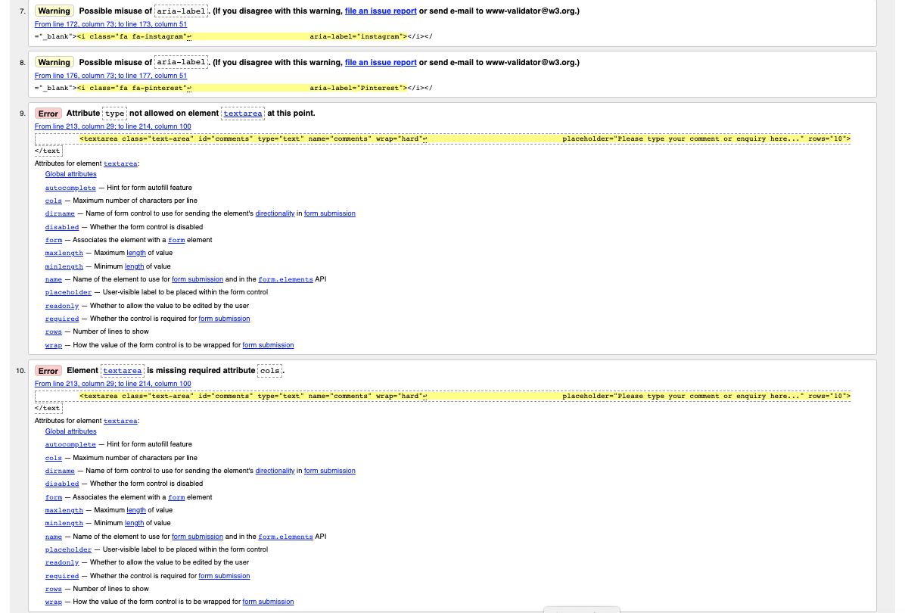
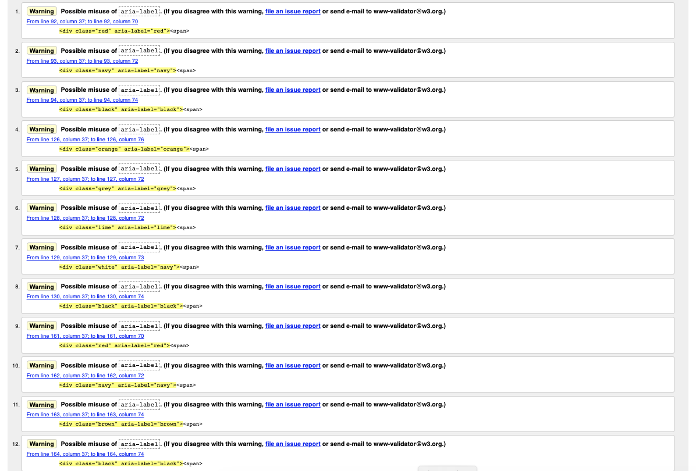
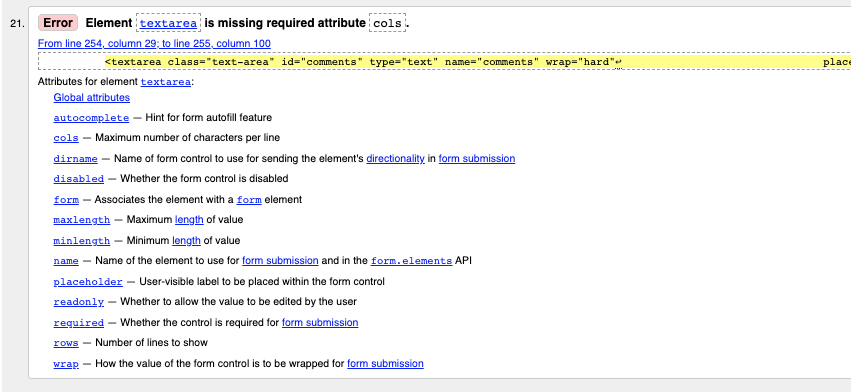
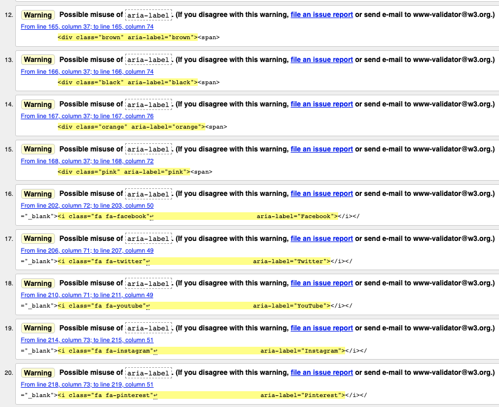
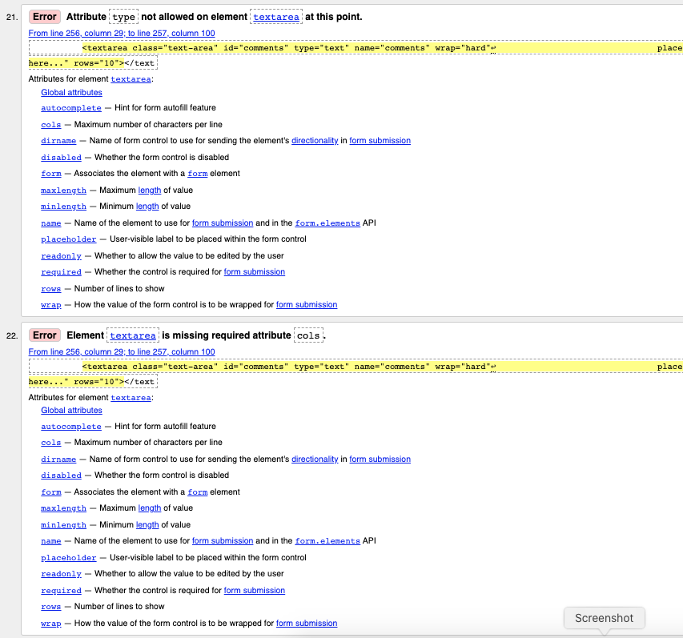
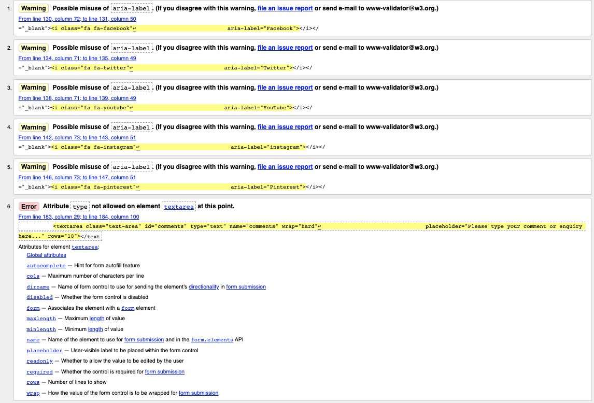
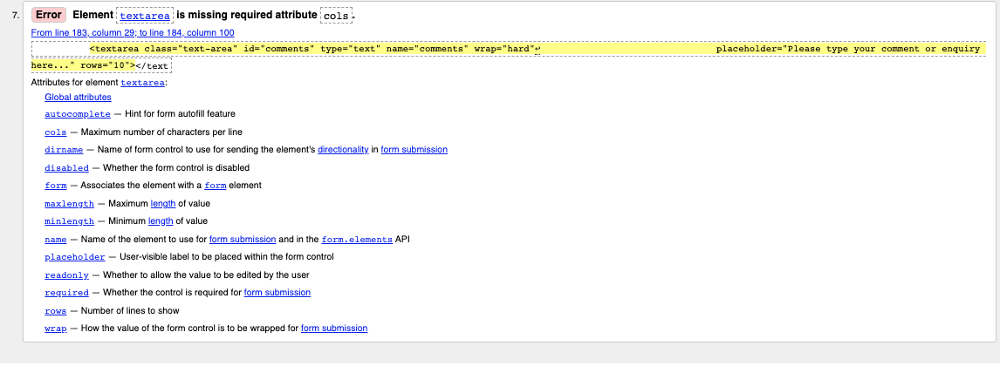

# Test Strategy

## Contents

1.  [Scope and Overview](#scope-and-overview)
2.  [Test Approach](#test-approach)
3.  [Test Tools](#test-tools)
4.  [Review and Approvals](#review-and-approvals)
5.  [Test Results](#test-results)
6.  [Approvals](#approvals)

### Scope and Overview

The Urban Paws website is a basic static website that has been developed for a startup company. The website enables users to find out more about the company, view products for sale and link to the Amazon listing for purchase of the products, link to the company social media accounts and contact the company via a contact form. The website is comprised of four pages - Home, Shop-Dog, Shop-Cat and About Us, with modals incorporated for the contact form and product size guides.

The website has been developed using HTML5 and CSS3 and utilises the Bootstrap4 toolkit.

This document has been prepared to outline the testing strategy and will be approved by the owner of the Urban Paws business and website.

The testing consists of two cycles, each with two phases. Within each test cycle the developer completes the first phase of testing prior to the business owner conducting their own testing.

View the live website [here.](https://matty-el.github.io/urban-paws/)

### Test Approach

The user requirements have been captured in the form of user stories and acceptance criteria have been defined against which to test the website functionality.

Defects identified during test cycle 1 of the testing process are captured in JIRA, fixed and then released to be re-tested in test cycle 2.

The testing to be completed along with the roles completing the testing are outlined below:

- Code validation - Roles: developer
- Functional testing - Roles: developer and business owner
- Usability testing - Roles: developer and business owner
- Compatibility testing (browser compatibility and mobile compatibility) - Roles: developer
- Performance testing - Roles: developer
- Accessibility testing - Roles: developer
- Best Practices testing - Roles: developer
- SEO testing - Roles: developer

### Test Tools

- Code validation: [W3.org markup validation service](https://validator.w3.org/), [W3.org CSS validation service](https://jigsaw.w3.org/css-validator/).
- Compatibility testing (browser compatibility and mobile compatibility) - [Google Chrome DevTools - Lighthouse](https://developers.google.com/web/tools/lighthouse), [Responsiveness Checker](https:).
- Performance testing: [Google Chrome DevTools - Lighthouse](https://developers.google.com/web/tools/lighthouse).
- SEO testing: [Google Chrome DevTools - Lighthouse](https://developers.google.com/web/tools/lighthouse)
- Defect capture and tracking: [JIRA](https://www.atlassian.com/software/jira).

### Review and Approvals

Following the final cycle of testing the website will be approved for release by the Urban Paws business owner.

### Test Results

### Test Cycle 1

#### Code validation

**HTML**

[W3.org markup validation service](https://validator.w3.org/)

Home page:

Issues identified and resolution:

-   Error Attribute alt not allowed on element a at this point - removed alt attributes from anchor elements.
-   Error no p element in scope but a p end tag seen - removed erroneous paragraph closing tag.
-   Warning Possible misuse of aria-label - removed aria labels from social media list and replaced with sr-only text.
-   Error Attribute type not allowed on element textarea at this point - removed type attribute from textarea element.
-   Error Element textarea is missing required attribute - added missing cols attribute to textarea element.

Shop Dog page:

Issues identified and resolution:

-   Warning Possible misuse of aria-label - removed aria labels from colour swatches.
-   Warning Possible misuse of aria-label - removed aria labels from social media list and replaced with sr-only text.
-   Error Attribute type not allowed on element textarea at this point - removed type attribute from textarea element.
-   Error Element textarea is missing required attribute - added missing cols attribute to textarea element.

Shop Cat page:

Issues identified and resolution:

-   Warning Possible misuse of aria-label - removed aria labels from colour swatches.
-   Warning Possible misuse of aria-label - removed aria labels from social media list and replaced with sr-only text.
-   Error Attribute type not allowed on element textarea at this point - removed type attribute from textarea element.
-   Error Element textarea is missing required attribute - added missing cols attribute to textarea element.

About Us page:

Issues identified and resolution:

-   Warning Possible misuse of aria-label - removed aria labels from social media list and replaced with sr-only text.
-   Error Attribute type not allowed on element textarea at this point - removed type attribute from textarea element.
-   Error Element textarea is missing required attribute - added missing cols attribute to textarea element.

**CSS**

[W3.org CSS validation service](https://jigsaw.w3.org/css-validator/)

#### Functional, Usability and Compatibility Testing

The functional, usability and compatibility test results and defect references are detailed in the [test tracker](testing-files/Urban_Paws_Website_Test_Tracker_Cycle_1.pdf).

#### Performance, Accessibility, Best Practices and SEO Testing

**Desktop:**

[Home page](https://matty-el.github.io/urban-paws/testing-files/desktop-index.html)

Issues identified and resolution:

Performance (98)

-   Opportunity: Eliminate render-blocking resources -
-   Opportunity: Properly size images - images resized.
-   Opportunity; Serve images in next-gen formats - Images left as JPEG or PNG files as not considered to detrimental to performance on desktop device.
-   Diagnostics: Ensure text remains visible during webfont load - Google recommends 'Add the &display=swap parameter to the end of your Google Fonts URL:' this parameter is already included in code.
-   Diagnostics: Image elements do not have explicit width and height - TBC
-   Diagnostics: Serve static elements with an efficient cache policy - TBC
-   Diagnostics: Avoid chaining critical requests - TBC
-   Diagnostics: Keep request counts low and transfer sizes small - TBC
-   Diagnostics: Avoid large layout shifts - TBC
-   Diagnostics: Avoid long main-thread tasks - TBC

Accessibility (98)

-   Contrast: Background and foreground colours do not have sufficient contrast ratio: Shop, About Us and Contact menu items - changed text colour to Urban Paws #4B5657 to achieve greater contrast.

Best Practices (79)

-   Trust and Safety: Links to cross-origin destinations are unsafe - added rel="noopener and norefferer" tags to Links.
-   Trust and Safety: Includes front-end JavaScript libraries with known security vulnerabilities - updated to libraries with no vulnerabilities.
-   User Experience: Displays images with incorrect aspect ratio (Shop Cat image) - changed aspect ratio.

SEO (90)

-   Content Best Practices: Document does not have a meta-description - a meta-description is included and is now recognised.
 

[Shop Dog page](https://matty-el.github.io/urban-paws/testing-files/desktop-shop-dog.html)

Issues identified and resolution:

Performance (98)

-   Opportunity: Eliminate render-blocking resources - TBC
-   Opportunity: Properly size images - images resized.
-   Opportunity: Serve images in next-gen formats - Images left as JPEG or PNG files as not considered to detrimental to performance on desktop device.
-   Diagnostics: Ensure text remains visible during webfont load - Google recommends 'Add the &display=swap parameter to the end of your Google Fonts URL:' this parameter is already included in code.
-   Diagnostics: Image elements do not have explicit width and height - TBC
-   Diagnostics: Serve static elements with an efficient cache policy - TBC
-   Diagnostics: Avoid chaining critical requests - TBC
-   Diagnostics: Keep request counts low and transfer sizes small - TBC
-   Diagnostics: Largest Contentful Paint element - TBC
-   Diagnostics: Avoid large layout shifts - TBC

Accessibility (98)

-   Contrast: Background and foreground colours do not have sufficient contrast ratio: Shop, About Us and Contact menu items - changed text colour to Urban Paws #4B5657 to achieve greater contrast.

Best Practices (79)

-   Trust and Safety: Links to cross-origin destinations are unsafe - added rel="noopener and norefferer" tags to Links.
-   Trust and Safety: Includes front-end JavaScript libraries with known security vulnerabilities - updated to libraries with no vulnerabilities.
-   User Experience: Displays images with incorrect aspect ratio (Shop Cat image) - changed aspect ratio.

SEO (80)

-   Content Best Practices: Document does not have a meta-description - a meta-description is included and now recognised.
-   Crawling and Indexing: Links are not crawlable - link for modal so not relevant
 

[Shop Cat page](https://matty-el.github.io/urban-paws/testing-files/desktop-shop-cat.html)

Issues identified and resolution:

Performance (97)

-   Opportunity: Eliminate render-blocking resources - TBC
-   Opportunity: Properly size images - images resized.
-   Opportunity: Remove unused JavaScript - TBC
-   Opportunity: Remove duplicate modules in JavaScript bundles - TBC
-   Opportunity: Serve images in next-gen formats - Images left as JPEG or PNG files as not considered to detrimental to performance
-   Diagnostics: Ensure text remains visible during webfont load - Google recommends 'Add the &display=swap parameter to the end of your Google Fonts URL:' this parameter is already included in code.
-   Diagnostics: Image elements do not have explicit width and height - TBC
-   Diagnostics: Serve static elements with an efficient cache policy - TBC
-   Diagnostics: Avoid chaining critical requests - TBC
-   Diagnostics: Keep request counts low and transfer sizes small - TBC
-   Diagnostics: Largest Contentful Paint element - TBC
-   Diagnostics: Avoid large layout shifts - TBC

Accessibility (98)

-   Contrast: Background and foreground colours do not have sufficient contrast ratio: Shop, About Us and Contact menu items - changed text colour to Urban Paws #4B5657 to achieve greater contrast.

Best Practices (79)

-   Trust and Safety: Links to cross-origin destinations are unsafe - added rel="noopener and norefferer" tags to Links.
-   Trust and Safety: Includes front-end JavaScript libraries with known security vulnerabilities - updated to libraries with no vulnerabilities.
-   User Experience: Displays images with incorrect aspect ratio (Shop Cat image) - changed aspect ratio.

SEO (80)

-   Content Best Practices: Document does not have a meta-description - a meta-description is included and is recognised.
-   Crawling and Indexing: Links are not crawlable - link for modal so not relevant
 

[About Us page](https://matty-el.github.io/urban-paws/testing-files/desktop-about.html)

Issues identified and resolution:

Performance (98)

-   Opportunity: Eliminate render-blocking resources - TBC
-   Opportunity: Properly size images - images resized.
-   Opportunity: Serve images in next-gen formats - Images left as JPEG or PNG files as not considered to detrimental to performance
-   Diagnostics: Avoid enormous network payloads - TBC
-   Diagnostics: Serve static elements with an efficient cache policy - TBC
-   Diagnostics: Ensure text remains visible during webfont load - Google recommends 'Add the &display=swap parameter to the end of your Google Fonts URL:' this parameter is already included in code.
-   Diagnostics: Image elements do not have explicit width and height - TBC
-   Diagnostics: Avoid chaining critical requests - TBC
-   Diagnostics: Keep request counts low and transfer sizes small - TBC
-   Diagnostics: Largest Contentful Paint element - TBC
-   Diagnostics: Avoid large layout shifts - TBC

Accessibility (97)

-   Contrast: Background and foreground colours do not have sufficient contrast ratio: Shop, About Us and Contact menu items - changed text colour to Urban Paws #4B5657 to achieve greater contrast.
-   Navigation: Heading elements are not in sequentially-descending order - changed sequential order

Best Practices (79)

-   Trust and Safety: Links to cross-origin destinations are unsafe - added rel="noopener and norefferer" tags to Links.
-   Trust and Safety: Includes front-end JavaScript libraries with known security vulnerabilities - updated to libraries with no vulnerabilities.
-   User Experience: Displays images with incorrect aspect ratio (Shop Cat image) - changed aspect ratio.

SEO (80)

-   Content Best Practices: Document does not have a meta-description - a meta-description is included so need to check why this issue is occurring.
-   Crawling and Indexing: Links are not crawlable - link for modal so not relevant.

**Mobile:**

[Home page](https://matty-el.github.io/urban-paws/testing-files/mobile-index.html)

Issues identified and resolution:

Performance (70)

-   Opportunity: Eliminate render-blocking resources - TBC
-   Opportunity: Remove unused CSS - TBC
-   Opportunity: Remove unused JavaScript - TBC
-   Opportunity: Properly size images - TBC
-   Diagnostics: Ensure text remains visible during webfont load - Google recommends 'Add the &display=swap parameter to the end of your Google Fonts URL:' this parameter is already included in code.
-   Diagnostics: Image elements do not have explicit width and height - TBC
-   Diagnostics: Serve static elements with an efficient cache policy - TBC
-   Diagnostics: Minimize main-thread work - TBC
-   Diagnostics: Avoid chaining critical requests - TBC
-   Diagnostics: User Timing marks and measures - TBC
-   Diagnostics: Keep request counts low and transfer sizes small - TBC
-   Diagnostics: Largest Contentful Paint element - TBC
-   Diagnostics: Avoid large layout shifts - TBC
-   Diagnostics: Avoid long main-thread tasks - TBC

Accessibility (100)

-   No issues identified

Best Practices (71)

-   Trust and Safety: Links to cross-origin destinations are unsafe - added rel="noopener and norefferer" tags to Links.
-   Trust and Safety: Includes front-end JavaScript libraries with known security vulnerabilities - updated to libraries with no vulnerabilities.
-   User Experience: Displays images with incorrect aspect ratio (Shop Cat image) - changed aspect ratio.
-   General: Browser errors were logged to the console (font-awesome files not found) - TBC

SEO (100)

-   No issues identified.
 

[Shop Dog page](https://matty-el.github.io/urban-paws/testing-files/mobile-shop-dog.html)

Issues identified and resolution:

Performance (79)

-   Opportunity: Eliminate render-blocking resources - TBC
-   Opportunity: Properly size images - TBC
-   Opportunity: Remove unused CSS - TBC
-   Opportunity: Remove unused JavaScript - TBC
-   Opportunity: Remove duplicate modules in JavaScript bundles - TBC
-   Opportunity: Avoid serving legacy JavaScipt to modern browsers - TBC
-   Diagnostics: Ensure text remains visible during webfont load - Google recommends 'Add the &display=swap parameter to the end of your Google Fonts URL:' this parameter is already included in code.
-   Diagnostics: Image elements do not have explicit width and height - TBC
-   Diagnostics: Serve static elements with an efficient cache policy - TBC
-   Diagnostics: Minimise main-thread work - TBC
-   Diagnostics: Avoid chaining critical requests - TBC
-   Diagnostics: User Timing marks and measures - TBC
-   Diagnostics: Keep request counts low and transfer sizes small - TBC
-   Diagnostics: Largest Contentful Paint element - TBC
-   Diagnostics: Avoid large layout shifts - TBC
-   Diagnostics: Avoid long main-thread tasks - TBC

Accessibility (97)

-   Contrast: Background and foreground colours do not have sufficient contrast ratio: Shop, About Us and Contact menu items - changed text colour to Urban Paws #4B5657 to achieve greater contrast.

Best Practices (71)

-   Trust and Safety: Links to cross-origin destinations are unsafe - added rel="noopener and norefferer" tags to Links.
-   Trust and Safety: Includes front-end JavaScript libraries with known security vulnerabilities - updated to libraries with no vulnerabilities.
-   User Experience: Displays images with incorrect aspect ratio - changed aspect ratio.
-   General: Browser errors were logged to the console (font-awesome files not found) - TBC

SEO (92)

-   Crawling and Indexing: Links are not crawlable - link for modal so not relevant
 

- [Shop Cat page](https://matty-el.github.io/urban-paws/testing-files/mobile-shop-cat.html)

Issues identified and resolution:

Performance (77)

-   Opportunity: Eliminate render-blocking resources - TBC
-   Opportunity: Properly size images - TBC
-   Opportunity: Remove unused CSS - TBC
-   Opportunity: Remove unused JavaScript - TBC
-   Opportunity: Remove duplicate modules in JavaScript bundles - TBC
-   Opportunity: Avoid serving legacy JavaScipt to modern browsers - TBC
-   Diagnostics: Ensure text remains visible during webfont load - Google recommends 'Add the &display=swap parameter to the end of your Google Fonts URL:' this parameter is already included in code.
-   Diagnostics: Image elements do not have explicit width and height - TBC
-   Diagnostics: Serve static elements with an efficient cache policy - TBC
-   Diagnostics: Minimise main-thread work - TBC
-   Diagnostics: Reduce JavaScript execution time - TBC
-   Diagnostics: Avoid chaining critical requests - TBC
-   Diagnostics: User Timing marks and measures - TBC
-   Diagnostics: Keep request counts low and transfer sizes small - TBC
-   Diagnostics: Largest Contentful Paint element - TBC
-   Diagnostics: Avoid large layout shifts - TBC
-   Diagnostics: Avoid long main-thread tasks - TBC

Accessibility (97)

-   Contrast: Background and foreground colours do not have sufficient contrast ratio: Shop, About Us and Contact menu items - changed text colour to Urban Paws #4B5657 to achieve greater contrast.

Best Practices (71)

-   Trust and Safety: Links to cross-origin destinations are unsafe - added rel="noopener and norefferer" tags to Links.
-   Trust and Safety: Includes front-end JavaScript libraries with known security vulnerabilities - updated to libraries with no vulnerabilities.
-   User Experience: Displays images with incorrect aspect ratio (Shop Cat image) - changed aspect ratio.
-   General: Browser errors were logged to the console (font-awesome files not found) - TBC

SEO (92)

-   Crawling and Indexing: Links are not crawlable - link for modal so not relevant
 

[About Us page](https://matty-el.github.io/urban-paws/testing-files/mobile-about.html)

Issues identified and resolution:

Performance (70)

-   Opportunity: Eliminate render-blocking resources - TBC
-   Opportunity: Remove unused CSS - TBC
-   Opportunity: Properly size images - TBC
-   Opportunity: Remove unused JavaScript - TBC
-   Opportunity: Remove duplicate modules in JavaScript bundles - TBC
-   Opportunity: Avoid serving legacy JavaScipt to modern browsers - TBC
-   Diagnostics: Ensure text remains visible during webfont load - Google recommends 'Add the &display=swap parameter to the end of your Google Fonts URL:' this parameter is already included in code.
-   Diagnostics: Image elements do not have explicit width and height - TBC
-   Diagnostics: Serve static elements with an efficient cache policy - TBC
-   Diagnostics: Minimise main-thread work - TBC
-   Diagnostics: Avoid chaining critical requests - TBC
-   Diagnostics: User Timing marks and measures - TBC
-   Diagnostics: Keep request counts low and transfer sizes small - TBC
-   Diagnostics: Largest Contentful Paint element - TBC
-   Diagnostics: Avoid large layout shifts - TBC
-   Diagnostics: Avoid long main-thread tasks - TBC

Accessibility (98)

-    Navigation: Heading elements are not in sequentially-descending order - changed sequential order.

Best Practices (71)

-   Trust and Safety: Links to cross-origin destinations are unsafe - added rel="noopener and norefferer" tags to Links.
-   Trust and Safety: Includes front-end JavaScript libraries with known security vulnerabilities - updated to libraries with no vulnerabilities.
-   User Experience: Displays images with incorrect aspect ratio (Shop Cat image) - changed aspect ratio.
-   General: Browser errors were logged to the console - TBC

SEO (92)

-   Crawling and Indexing: Links are not crawlable - link for modal so not relevant

### Test Cycle 2

#### Code validation

**HTML**

[W3.org markup validation service](https://validator.w3.org/)

Home page:

Issues identified and resolution

Shop Dog page:

Issues identified and resolution

Shop Cat page:

Issues identified and resolution

About Us page:

Issues identified and resolution

**CSS**

[W3.org CSS validation service](https://jigsaw.w3.org/css-validator/)

#### Functional, Usability and Compatibility Testing

To add details from Excel tracking table

#### Performance, Accessibility, Best Practices and SEO Testing

Desktop:

- [Home page](testing-files/)
- [Shop Dog page](testing-files/)
- [Shop Cat page](testing-files/)
- [About Us page](testing-files/)

Issues identified and resolution

Mobile:

- [Home page](testing-files/)
- [Shop Dog page](testing-files/)
- [Shop Cat page](testing-files/)
- [About Us page](testing-files/)

Issues identified and resolution

### Approvals

[Go back to README.md file](README.md).
